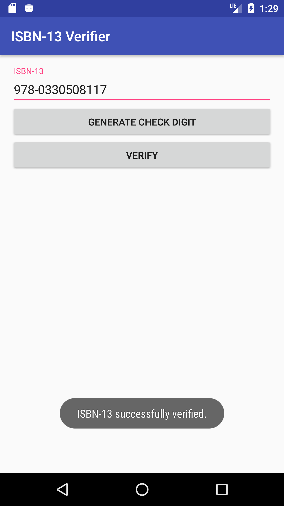

# 📒 Isbn13Verifier
Verifies and generates check digits for ISBN-13 numbers

## ⚡ Deployment

These instructions will get you a release of this project up and running on your local machine, so that you can start using it.

### Prerequisites

* [Android 4.0.3+](https://developer.android.com/about/versions/android-4.0.3.html)

### Getting Started

Just copy over the apk and install it.

## 🛠️ Development

These instructions will get you a copy of this project up and running on your local machine for development and testing purposes.

### Prerequisites

* [Android Studio](https://developer.android.com/studio/index.html) - The Official IDE for Android

### Troubleshooting

#### Q: How do I get the app to run? It just opens the "Edit configuration" dialog with "Error: Please select Android SDK". 
Just sync gradle by clicking  in the toolbar and it should work.

## 👨‍💻 Authors

* **Robin Hartmann** - [robin-hartmann](https://github.com/robin-hartmann)

## 📃 License

This project is licensed under the MIT License - see the [LICENSE](LICENSE) file for details
